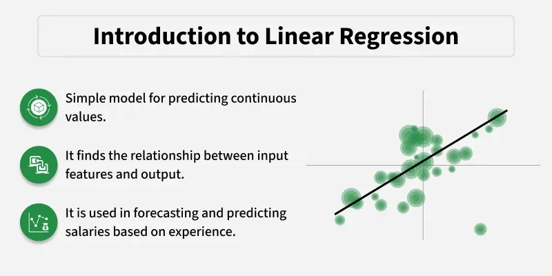
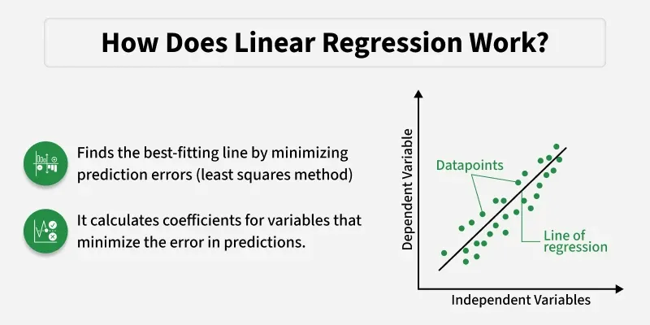
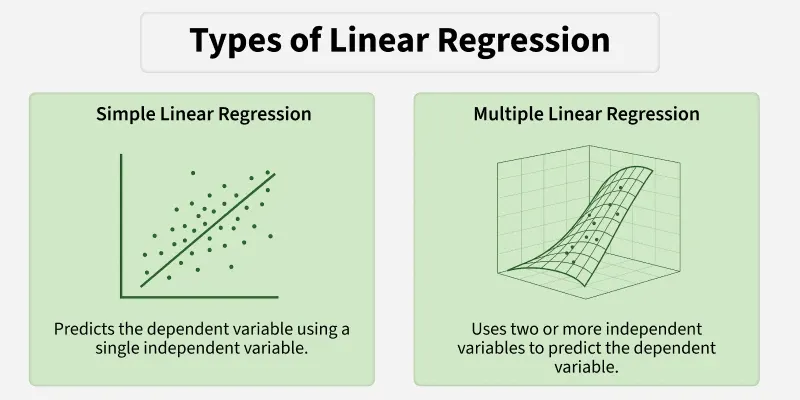
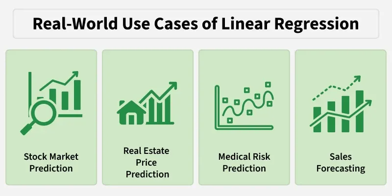
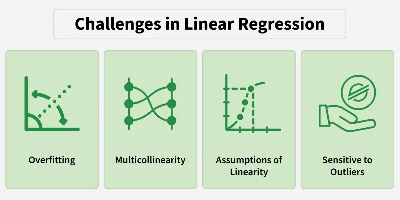

# Linear Regression

Linear Regression is a fundamental supervised learning algorithm used to model the relationship between a dependent variable and one or more independent variables.  
→ It predicts continuous values by fitting a straight line that best represents the data. 
- It assumes that there is a linear relationship between the input and output
- Uses a best‑fit line to make predictions
- Commonly used in forecasting, trend analysis, and predictive modelling 

*Chatgpt*  
→ Linear Regression is a supervised machine learning algorithm used to predict a continuous numerical value.  
→ It tries to find the best-fit straight line that represents the relationship between input features (X) and output (Y).

**Introduction of Linear regression**  

---
EX:- Suppose we want to predict a student’s exam score based on the number of hours studied. As study hours increase, exam scores generally increase as well. Here:

- **Independent variable (input):** Hours studied because it's the factor we control or observe.
- **Dependent variable (output):** Exam score because it depends on how many hours were studied.  
- Linear regression uses the independent variable to predict the dependent variable.